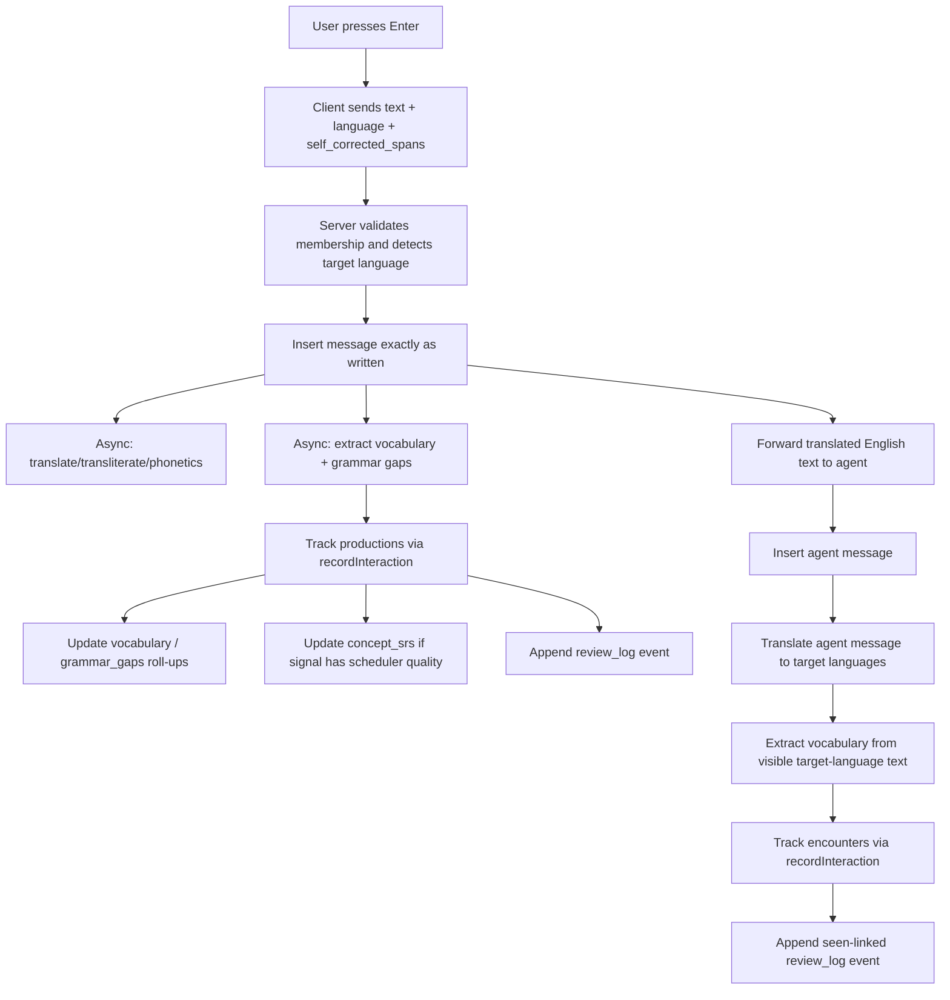
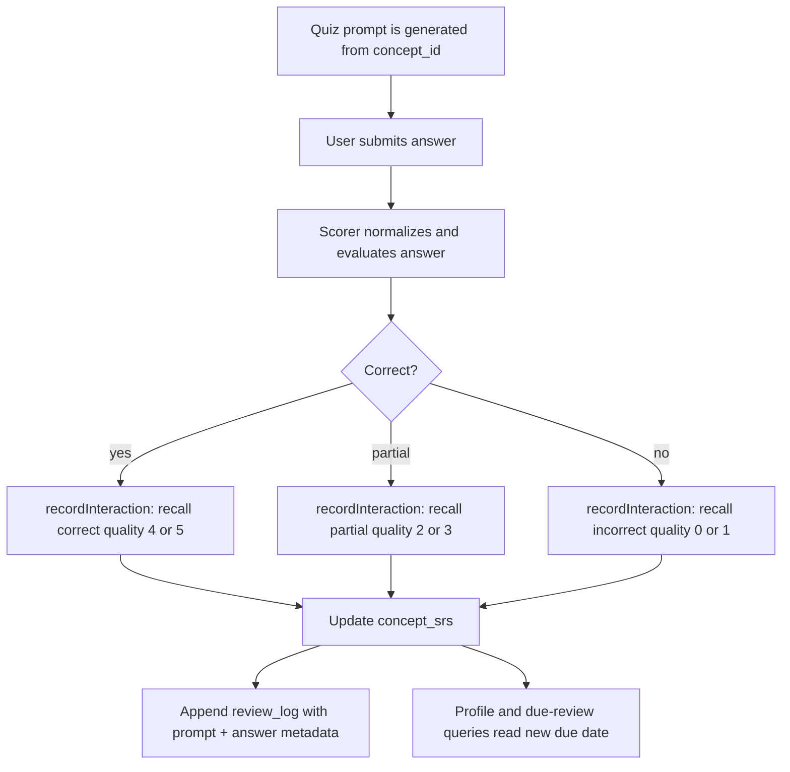

# Learning Tracking

This document is the implementation contract for how Langouste records what a learner has **seen**, what they have **produced**, what they produced **with errors**, what content they have **worked through**, what they later answer correctly or incorrectly in **review/quiz surfaces**, and how those signals become level estimates and due dates.

`docs/ONTOLOGY.md` defines *what* can be learned. `docs/PARSING.md` defines how we recognize concepts in language. `docs/LEARNING-MODEL.md` defines the pedagogical rationale. This document defines the event model and state transitions that keep the learner profile synced with the database.

## Core rule

The database is the source of truth.

The UI may optimistically render a message or a profile panel, but the learning state of a chat, profile, vocabulary item, grammar concept, quiz result, or future concept card is whatever can be reconstructed from:

1. the durable content rows (`messages`, `vocabulary`, `grammar_gaps`, and future `concepts` rows),
2. the atomic memory rows (`concept_srs`),
3. and the append-only event stream (`review_log`).

If those disagree, the event stream and `concept_srs` win. Roll-up counters on item rows exist for speed and UI compatibility; they are not the conceptual source of truth.

## Terms

### Concept

A concept is the atomic thing the learner can know, fail, practice, or review.

Examples:

- lexical item: `jó`, `napot`, `kívánok`, `manger`, `to go`
- lexical chunk: `jó napot kívánok`
- morphology: first-person singular present conjugation of `kíván`
- syntax: adjective placement, auxiliary choice, relative clauses
- orthography: Hungarian acute accent contrast, French `é` vs `è`
- phonology: /y/ vs /u/
- pragmatics: formal greeting, `tu` vs `vous`
- discourse: using `donc`, `however`, topic continuation

The current implementation supports vocabulary and grammar gap rows directly, with `concept_id` bridging them into `concept_srs`. The long-term model is that every row in every dimension points at a stable concept ID from the ontology.

### Encounter / seen

An encounter means the learner was exposed to a concept in input.

Examples:

- the agent says a word in the learner's target-language view;
- a generated reading passage contains a known concept;
- a correction explanation shows an example sentence;
- a future listening transcript contains a phrase;
- a user opens a reference example.

Encounters answer: **"Has the learner seen this before, and where?"**

They do **not** prove recall. They increment exposure history and link back to the message/content location. By default they do not advance FSRS scheduling.

### Production / produced

A production means the learner attempted to use the concept themselves.

Examples:

- the learner writes `jó napot kivánok`;
- the learner types a conjugated form in chat;
- the learner speaks a target phrase;
- the learner completes an exercise that requires generating the form.

Productions answer: **"Can the learner retrieve and use this under communicative pressure?"**

Productions can be correct, partial, or incorrect. Self-corrected productions count as incorrect for learning-credit purposes because the learner only got to the final form after correction scaffolding.

### Recall / review / quiz

A recall means the learner was explicitly tested on a concept and gave an answer that can be scored.

Examples:

- SRS review card;
- multiple-choice quiz;
- fill-in-the-blank conjugation;
- listening discrimination;
- spelling dictation;
- speaking/pronunciation prompt;
- cloze deletion for a discourse connector.

Recalls answer: **"Can the learner retrieve this now?"**

Recall is the strongest signal for the scheduler because the surface is controlled and the answer is scored.

## Event model

Every learning-relevant action is represented as a `recordInteraction(...)` call.

Current event types:

| Event type | Meaning | Schedules FSRS by default? | Main roll-up |
|---|---|---:|---|
| `encounter` | Learner saw the concept in input | No | `encounters++`, `last_encounter_at` |
| `production` | Learner attempted to use the concept | Yes | `productions++`, outcome counters |
| `recall` | Learner answered an explicit review/quiz prompt | Yes | FSRS review state |

Current sources:

| Source | Typical surface | Event type | Default quality |
|---|---|---|---:|
| `chat_encounter` | agent/translated target-language message | `encounter` | `null` |
| `chat_produce` | clean learner-authored message | `production` | `4` |
| `chat_correct` | grammar/vocabulary issue detected in final sent message | `production` | `1` |
| `chat_self_correct` | learner corrected using correction info before sending | `production` | `1` |
| `reading_sentence` | article sentence hovered or inspected | `encounter` | `null` |
| `reading_word` | aligned article word opened/hovered | `encounter` | `null` |
| `reading_vocabulary` | authored article vocabulary note selected | `encounter` | `null` |
| `reading_audio` | article sentence played | `heard` | `null` |
| `reading_workbench` | article sentence handed to Workbench | `encounter` | `null` |
| `content_encounter` | podcast/video/tutorial transcript span viewed or heard | `encounter` | `null` |
| `assignment_encounter` | teacher-assigned passage or media segment viewed or heard | `encounter` | `null` |
| `review` | explicit SRS review | `recall` | caller-provided `0..5` |
| `exercise` | future controlled exercise/quiz | `production` or `recall` | tunable |

The `review_log` row stores:

- `user_id`, `language`
- `item_type`, `item_id`, `concept_id`
- `event_type`, `outcome`, `quality`, `source`
- `message_id` when the event came from chat
- future content anchors: `content_item_id`, `content_segment_id`, `start_offset`, `end_offset`, and/or `timestamp_ms`
- `before_state`, `after_state`
- `observed_at`

That makes every profile number auditable. If a user asks why a word is due today, we can show the sequence: seen here, produced wrong here, reviewed wrong here, reviewed correct here.

Reading surfaces also append an idempotent `reading_interactions` row keyed by
learner, edition, event type, language, and Filo coordinates. The exact target
and source text is resolved server-side from the learner-owned
`corpus_documents` Filo document. This preserves article context for the
profile without trusting arbitrary client-supplied text or inflating counters
on repeated pointer events.

## Current chat flow

### User submits a message



The user's message is never rewritten. The final sent text is the user's responsibility.

### Self-correction rule

If the user first writes a wrong word or concept, receives correction information, and then sends the corrected form, the production is still a failed cold production.

Example:

1. User writes: `jo napot kivánok`
2. Correction info points them to: `jó napot kívánok`
3. User sends: `jó napot kívánok`
4. The profile records the relevant lexical/orthographic concepts as:
   - `productions += 1`
   - `correct_productions += 0`
   - `self_corrected_productions += 1`
   - `outcome = "incorrect"`
   - `source = "chat_self_correct"`
   - scheduler quality defaults to `1`

This is the honest model: the user did not retrieve it successfully without help.

### Seen vs produced in chat

Agent target-language output creates seen events, not produced events.

Example:

1. Agent response is stored in English as canonical agent text.
2. It is translated into the learner's target language for display.
3. The target-language visible text is passed through vocabulary extraction.
4. Each extracted item records:
   - `event_type = "encounter"`
   - `source = "chat_encounter"`
   - `message_id = agent_message.message_id`
   - `encounters += 1`
   - `productions += 0`
   - `correct_productions += 0`

Profile detail should therefore be able to show:

- `Seen: 1`
- `Produced: 0`
- a recent linked message containing the actual target-language text the user saw

For the current implementation, encounter events are de-duped per `(user, language, term, message_id)` so repeated background translation requests do not inflate exposure counts for the same message.

## Content and assignment progress

Real-media surfaces create two kinds of state:

1. **Learning encounters** for the words, phrases, grammar patterns, pronunciation notes, and other concepts that appeared in the content.
2. **Content progress** for the learner's relationship to the episode, video, tutorial, passage, or assignment.

These should not be collapsed. Watching a podcast segment proves exposure, not mastery. Completing a teacher-assigned video proves task progress, not recall. Mastery still comes from production, correction, and scored recall events.

Recommended future tables:

```sql
content_sources
  source_id
  provider_type       -- podcast | youtube | tutorial_platform | publisher | school | other
  provider_name
  language
  metadata

content_items
  content_item_id
  source_id
  title
  content_type        -- episode | video | lesson | article | transcript | assignment_material
  duration_ms
  external_url
  metadata

content_segments
  content_segment_id
  content_item_id
  start_ms
  end_ms
  text
  normalized_text

user_content_progress
  user_id
  content_item_id
  status              -- not_started | started | completed | revisited
  started_at
  completed_at
  last_position_ms
  percent_complete
```

Concept encounters from content should point to a concrete segment plus offsets or timestamps. Profile views can then answer:

- "Which words and phrases has this learner seen, and in which real content?"
- "Which content has this learner completed?"
- "Which known/unknown vocabulary blocked comprehension in this episode?"
- "Which linguistic features are mastered, merely encountered, or still due for review?"

Classroom mode adds assignment ownership and visibility rules on top of the same model: teachers assign `content_items` or segment ranges; students work through them with inline support; learner concept state remains per student; teacher dashboards read only the progress and profile slices the student or institution has consented to share.

## Review and quiz flow

The review system must not be card-centric. A card, quiz prompt, cloze, listening item, or pronunciation prompt is only a surface. The tracked entity is the concept.

### Future quiz submission flow



### Quiz result schema expectations

When we add quiz tables, they should store prompt-level data separately from learning-state data.

Recommended split:

```sql
quiz_attempts
  attempt_id
  user_id
  language
  concept_id
  surface_type       -- cloze | multiple_choice | dictation | conjugation | speaking | listening
  prompt_payload     -- json: sentence, audio id, choices, target slot, etc.
  answer_payload     -- json: raw answer, normalized answer, latency, hint usage
  score              -- 0..1 task score for analytics
  quality            -- 0..5 scheduler quality
  outcome            -- correct | partial | incorrect
  created_at

review_log
  source = "review" or "exercise"
  event_type = "recall"
  quality = quiz_attempts.quality
  outcome = quiz_attempts.outcome
  concept_id = quiz_attempts.concept_id
  before_state / after_state
```

The `quiz_attempts` row explains what happened on the surface. The `review_log` row updates durable learning state.

### Quality mapping for quizzes

The scorer produces a normalized `quality` from `0..5`.

Recommended default:

| Quality | Meaning | FSRS rating |
|---:|---|---|
| `0` | blank, nonsensical, or recognized no part of it | Again |
| `1` | wrong, but related concept was attempted | Again |
| `2` | partially correct with important missing feature | Hard |
| `3` | correct after hesitation, typo, or minor weakness | Hard |
| `4` | correct normal recall | Good |
| `5` | immediate, confident, robust answer | Easy |

Different surfaces can tune this. A multiple-choice correct answer is weaker evidence than free production. A typed conjugation is stronger than recognition. A spoken answer with correct phonology is stronger than text-only recall for phonology concepts.

## Custom FSRS scheduler

Langouste uses a custom FSRS-6-inspired scheduler implemented over atomic concepts, not UI cards.

The memory state lives in `concept_srs`:

```sql
concept_srs
  user_id
  language
  concept_id
  item_type
  label
  difficulty
  stability
  retrievability
  interval_days
  repetitions
  lapses
  next_review_at
  last_reviewed_at
  created_at
  updated_at
```

### What the fields mean

- `difficulty`: how hard this concept appears for this learner. Higher means harder.
- `stability`: how long the learner can retain the concept after successful recall.
- `retrievability`: estimated probability that the learner can recall the concept right now.
- `interval_days`: scheduled delay until the next review.
- `lapses`: number of failed recall events after learning had begun.
- `next_review_at`: the next time the concept should be reviewed.

### Scheduling inputs

`recordInteraction` resolves the interaction into scheduler quality using `fsrs_configs.quality_weights`.

Default weights:

| Signal | Default quality |
|---|---:|
| `production:correct` | `4` |
| `production:partial` | `3` |
| `production:incorrect` | `1` |
| `chat_produce:production:correct` | `4` |
| `chat_correct:production:incorrect` | `1` |
| `chat_self_correct:production:incorrect` | `1` |
| `exercise:production:correct` | `4` |
| `exercise:production:partial` | `3` |
| `exercise:production:incorrect` | `1` |
| `encounter` | `null` |

`null` means "observe and log it, but do not advance the scheduler."

The important policy is that weights are tunable per `(user_id, language)`. If later evidence shows that clean chat production predicts future recall better than default quality `4`, we change the weight. If a surface is noisy, we reduce its weight. If a surface should never schedule, set it to `null`.

### Scheduler output

For every scheduling signal:

1. Load current `concept_srs` state.
2. Convert quality `0..5` to FSRS rating: Again, Hard, Good, Easy.
3. Update difficulty, stability, retrievability, interval, lapses, repetitions.
4. Clamp by configured maximum interval.
5. Write `next_review_at`.
6. Mirror `difficulty`, `interval_days`, `repetitions`, `next_review_at`, `last_reviewed_at` back to the legacy item row for current UI compatibility.
7. Append `review_log` with `before_state` and `after_state`.

Encounters skip steps 2–6 and only update exposure counts.

## Status and level estimation

There are three levels of "level":

1. concept status,
2. dimension band,
3. overall language band.

### Concept status

The UI can derive a concept status from roll-ups and FSRS state:

| Status | Rule of thumb |
|---|---|
| `unseen` | no encounter, production, or recall events |
| `seen` | encounters > 0 and productions = 0 and repetitions = 0 |
| `attempted` | productions > 0 but few or no successful signals |
| `learning` | some correct productions or recalls, low stability |
| `due` | `next_review_at <= now` |
| `strong` | high retrievability, repeated correct recall, stable interval |
| `struggling` | repeated incorrect productions/recalls, lapses, low accuracy |

These labels should be display logic, not stored as hand-mutated state unless we need query performance later.

### Dimension band

Each dimension aggregates concept evidence differently.

High-level pattern:

```text
dimension_score =
  coverage_weight * CEFR-weighted concept coverage
  + accuracy_weight * production / quiz accuracy
  + retention_weight * FSRS stability and retrievability
  - error_weight * recent error density
```

Examples:

- **Lexis**: number and rarity of lexical concepts with stable recall, adjusted by recent seen-only items.
- **Morphology**: CEFR-weighted paradigm slots with correct production and quiz recall.
- **Syntax**: correct use of UD relation patterns plus error rate.
- **Orthography**: spelling/accent concepts, self-corrections, dictation quizzes.
- **Phonology**: pronunciation/listening discrimination quiz results and audio mismatch scores.
- **Pragmatics**: register/politeness concepts, mostly low-confidence until enough signals exist.
- **Discourse**: connector/cohesion concepts and multi-sentence organization.

Seen-only evidence increases coverage confidence but should not imply mastery. A user who has seen 500 B1 words but produced or recalled none has exposure breadth, not B1 lexical control.

### Overall language band

The overall band is a conservative aggregate over dimensions.

Recommended rule:

- require minimum evidence per dimension before it can raise the overall band;
- let strong dimensions pull the band upward only when weak dimensions are not blocking communicative ability;
- display a band interval when evidence is uneven: `A2-B1`, not a false precise `B1`;
- display confidence separately from level.

The profile should be able to answer both:

- "What level is this learner overall in Hungarian?"
- "What level is their Hungarian orthography vs morphology vs lexis?"

## Due review selection

A concept is due when:

```text
concept_srs.next_review_at <= now
```

Selection should rank due items by:

1. overdue severity,
2. low retrievability,
3. recent failures or self-corrections,
4. importance/CEFR priority,
5. interleaving constraints across dimensions,
6. avoiding too many near-duplicate concepts in one session.

Current due routes return vocabulary and grammar-gap rows. Future due routes should return concept-level work items:

```json
{
  "concept_id": "u:morphology:verb.Person=1+Number=Sing+Tense=Pres",
  "dimension": "morphology",
  "language": "hu",
  "label": "first-person singular present conjugation",
  "due_at": "2026-05-18T12:00:00.000Z",
  "retrievability": 0.62,
  "recommended_surface": "conjugation_cloze",
  "eligible_surfaces": ["chat_prompt", "conjugation_cloze", "free_production"]
}
```

The review UI can then choose the best surface for the concept. The scheduler does not care whether that surface was a flashcard, cloze, dictation, or conversation prompt. It only receives the scored interaction.

## Database sync requirements

Every learning write must be durable and replayable.

Required invariants:

1. A visible target-language agent message that introduces a vocabulary item creates an `encounter` event linked to that message.
2. A learner-authored target-language message creates `production` events for extracted vocabulary and grammar concepts.
3. Self-corrected spans create failed production credit, not successful production credit.
4. A review or quiz answer creates a `recall` event with explicit `quality`.
5. Every scheduling mutation creates one `review_log` row with before/after state.
6. Roll-up counters must be derivable from `review_log`.
7. Reprocessing a message must not double-count the same seen item for the same message.
8. The profile UI must read persisted state; it must not invent transient counters from currently loaded chat messages.
9. The UI refreshes learning state through request/response APIs.
10. Offline or failed async extraction should be visible as missing/pending processing, not silently treated as zero knowledge.

## Known current limitations

The current implementation is intentionally transitional:

- Vocabulary and grammar are first-class; the other five dimensions still need explicit concept tables and extractors.
- `concept_srs` is authoritative, but legacy `vocabulary` and `grammar_gaps` still mirror SRS fields for current APIs.
- Agent-message encounter tracking currently focuses on target-language translated vocabulary, not full grammar/morphology/syntax exposure.
- Quiz attempt storage does not exist yet; review routes record direct recall quality for vocabulary and grammar rows.
- CEFR dimension bands are not fully derived from `concept_srs` yet; profile stats currently expose practical counters and item drill-downs.

The direction is clear: all dimensions emit the same interaction events into the same concept scheduler.

## Implementation map

Current files:

- `src/services/spaced-repetition/interactions.ts` — single write boundary for all learning interactions.
- `src/services/spaced-repetition/fsrs.ts` — custom concept-level FSRS scheduler.
- `src/services/spaced-repetition/config.ts` — per-user/per-language scheduler parameters and signal weights.
- `src/services/spaced-repetition/tracker.ts` — chat-specific tracking helpers for productions and encounters.
- `src/routes/api/messages.ts` — message submission, agent response, translation, and async tracking orchestration.
- `src/routes/api/review.ts` — due review queries and explicit recall submission.
- `src/routes/api/profile-stats.ts` — language/profile drill-down reads from persisted learning state.
- `src/lib/db/table-schema.ts` — durable event, roll-up, and FSRS logical schema.

Future files should preserve the same shape:

- extract concepts from a surface,
- score the learner action,
- call `recordInteraction`,
- let `concept_srs` and `review_log` become the durable source of truth.
